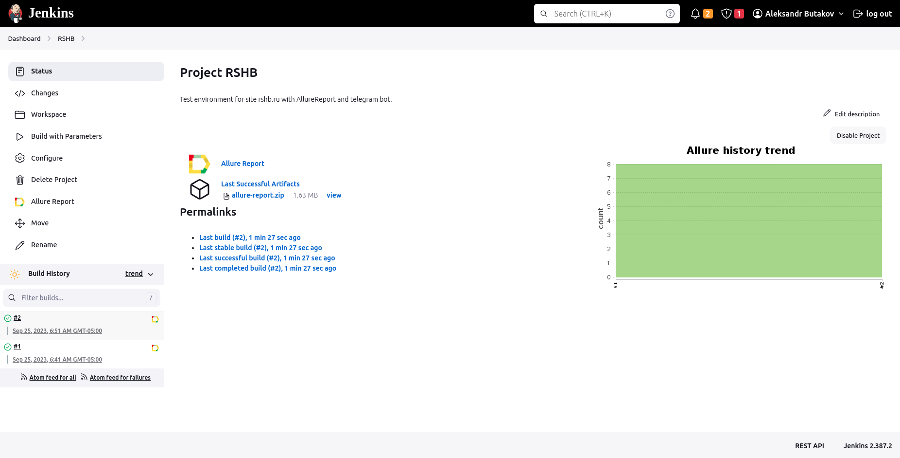
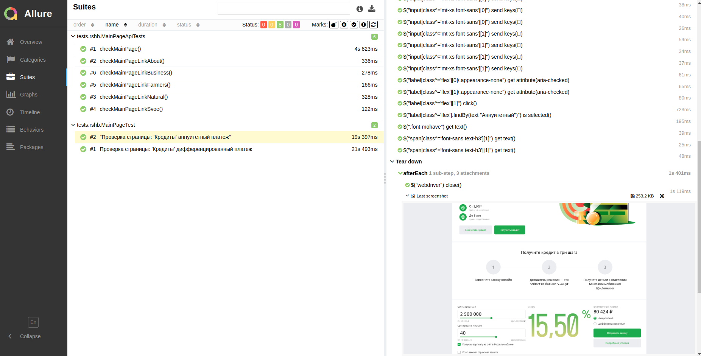

# Проект по автоматизации тестирования для Naumen
## <a target="_blank" href="https://naumen.ru/">Веб сайт https://naumen.ru</a>
## :o2: Содержание:

- <a href="#shinto_shrine-общая-информация-о-тестовом-фреймворке">Общая информация о тестовом фреймворке</a>
- <a href="#shinto_shrine-технологии-и-инструменты">Технологии и инструменты</a>
- <a href="#shinto_shrine-реализованные-проверки">Реализованные проверки</a>
- <a href="#shinto_shrine-сборка-в-Jenkins">Сборка в Jenkins</a>
- <a href="#shinto_shrine-запуск-из-терминала">Запуск из терминала</a>
- <a href="#shinto_shrine-allure-отчет">Allure отчет</a>
- <a href="#shinto_shrine-отчет-в-telegram">Отчет в Telegram</a>
- <a href="#shinto_shrine-видео-примеры-прохождения-тестов">Видео примеры прохождения тестов</a>

## :o2: Общая информация о тестовом фреймворке
&nbsp;&nbsp;&nbsp;Для реализации данного тестового фреймворка на хостинге был развернут VPS
с Ubuntu 22.04, установлен Docker, в Docker Compose подняты Jenkins, Selenoid and Selenoid UI,
настроены роли в Jenkins для доступа, загружены необходимые образы браузеров. Создан чат бот
в Telegram для получения уведомлений о прохождении тестов из Jenkins. Создан проект в
IntellijIDEA. Реализована параметризация с использованием библиотеки Owner и параллелизация
выполнения тестовых сценариев. Обработка данных из API запросов выполняется с использованием
библиотеки Lombok. Код запушен на GitHub. В коде добавлены все аттачменты для сохранения
статистики проходжения тестов, такие как: Screenshot, PageSource, BrowserConsole addVideo and
API тестов. 

## :o2: Технологии и инструменты
<p align="center">


</p>

## :o2: Реализованны проверки UI and API запросов
- Открытие сайта naumen.ru
- Переход по ссылке меню: 'Продукты'
- Переход по ссылке меню: 'Услуги'
- Переход по ссылке меню: 'Клиенты'
- Переход по ссылке меню: 'Партнеры'
- Переход по ссылке меню: 'О нас'
- Переход по ссылке меню: 'Пресс-центр'
- Переход по ссылке меню: 'Карьера'

### <a target="_blank" href="http://62.113.108.218:8888/job/Naumen/">Сборка в Jenkins</a>
<p align="center">
  
</p>

### Параметры сборки в Jenkins:
Сборка в Jenkins
- browser (браузер, по умолчанию chrome)
- browserVersion (default 112.0)
- browserSize (default 1920x1080)
- threads (количество потоков)

## :o2: Запуск из терминала
Локальный запуск:
```bash
gradle clean test
gradle clean ui_test
```

Удаленный запуск:
```bash
clean
-Dbrowser=${BROWSER}
-DbrowserVersion=${BROWSER_VERSION}
-Dthreads=${THREADS}
test
```

## :o2: Allure отчет    
- ### <a target="_blank" href="http://62.113.108.218:8888/job/Naumen/12/allure/">Главный экран отчета</a>
<p align="center">

</p>

- ### Страница с проведенными тестами
<p align="center">

</p>

## :o2: Отчет в Telegram
<p align="center">

</p>

## :o2: Видео примеры прохождения тестов
> К каждому тесту в отчете прилагается видео. Одно из таких видео представлено ниже.
<p align="center">
  
</p>